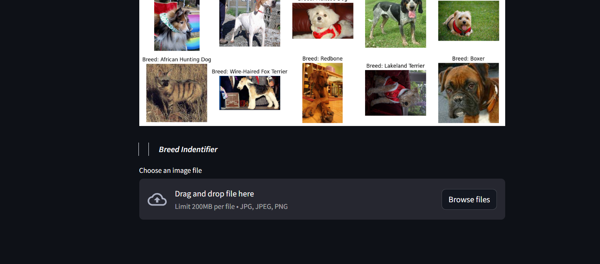
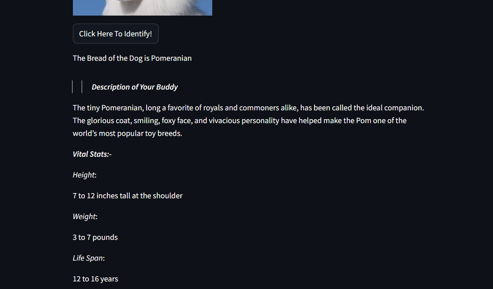

# Dog Breed Identifier

This project is a **Dog Breed Identifier** that allows users to upload images of dogs and receive predictions about their breeds. The model also suggests names based on the dog's gender and provides links to adopt similar breeds.

## Features

- **Breed Prediction**: Upload an image of a dog, and the model will identify its breed.

   

- **Dogs Breed Stats**: Get avg stats based on the dog's gender.
- **Name Suggestions**: Get personalized name suggestions based on the dog's gender.
- **Adoption Links**: Access links to adopt the breed identified.


 


## Model

The identifier is built using **ResNet50 V2**, a powerful convolutional neural network architecture. The model is trained on an open-source dataset containing over **10,000 dog images**, ensuring high accuracy in breed classification.

## Dataset

The dataset used for training the model consists of **10,000+ images** of various dog breeds, allowing the model to learn unique features and characteristics. The dataset is publicly available and can be accessed [here](https://www.kaggle.com/datasets/dilakshanchandrasena/dog-breed-classification).

## Requirements

To run this project, ensure you have the following installed:

- Python 3.x
- TensorFlow
- Flask
- Other dependencies listed in `requirements.txt`

## Installation

1. Clone the repository:

   ```bash
   git clone https://github.com/your_username/dog-breed-identifier.git
