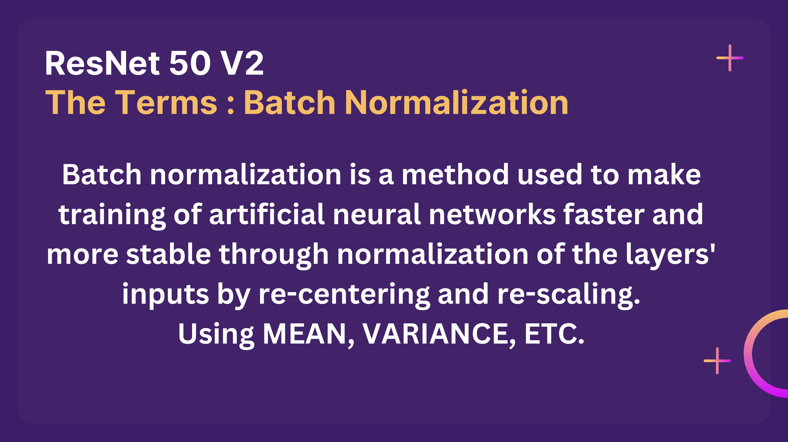

# Dog Breed Identifier

This project is an innovative Dog Breed Identifier that leverages advanced machine learning techniques to enable users to upload images of dogs and receive instant predictions about their breeds. Utilizing a robust neural network model, this application is designed to accurately identify a wide range of dog breeds, providing users with valuable insights about their pets.

**Technical Details**:
Model Architecture: The identifier is built on the ResNet50 V2 architecture, which is well-regarded for its performance in image classification tasks. This deep learning model is fine-tuned for dog breed classification to enhance prediction accuracy.

User-Friendly Interface: The application features a simple and intuitive interface, enabling users of all technical backgrounds to easily upload images and receive information in real time.

Open Source Dataset: The model was trained using an open-source dataset, which ensures a diverse range of dog breeds are covered, leading to improved model generalization and accuracy.


## Features

- **Breed Prediction**: Upload an image of a dog, and the model will identify its breed.

   

- **Dogs Breed Stats**: Get avg stats based on the dog's gender.
- **Name Suggestions**: Get personalized name suggestions based on the dog's gender.
- **Adoption Links**: Access links to adopt the breed identified.


 


## Model

The identifier is built using **ResNet50 V2**, a powerful convolutional neural network architecture. The model is trained on an open-source dataset containing over **10,000 dog images**, ensuring high accuracy in breed classification.


   


 
 

## Dataset

The dataset used for training the model consists of **10,000+ images** of various dog breeds, allowing the model to learn unique features and characteristics. The dataset is publicly available and can be accessed [here]([https://www.kaggle.com/datasets/dilakshanchandrasena/dog-breed-classification](https://www.kaggle.com/competitions/dog-breed-identification/data)).

## Requirements

To run this project, ensure you have the following installed:

- Python 3.x
- TensorFlow
- Flask
- Other dependencies listed in `requirements.txt`

## Installation

1. Clone the repository:

   ```bash
   git clone https://github.com/your_username/dog-breed-identifier.git
